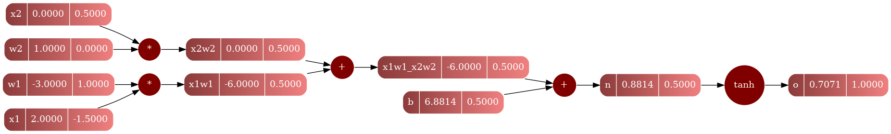

# Microc++
      Micrograd in C++ 

Hello there! This is my rendition of the micrograd by [Andrej Karpathy](https://www.youtube.com/watch?v=VMj-3S1tku0)/([repo](https://github.com/karpathy/micrograd)) with additional tools and all written in C++. I had a lot of fun working on this project, and I recommend anyone who is remotely interested in ML in C++ to give it a whirl.

Here are the general guidelines and the differences from his implementations. I am not an expert in C++, especially in ML topics, but I think the implementation doesn't have much imperfections; if you do have any improvement suggestions please do contribute and let me know how the change makes an improvement over the existing code.

### Micrograd
- Custom value and gradient system
- Graphviz visualization of the computational graph
- Fully working neural network implementation

Micrograd is the minimalistic neural network system implementation from scratch. It is a very good introduction to the concepts of neural networks and how they work. It is also a good introduction to the concepts of automatic differentiation and computational graphs. The implementation is very minimalistic and is a good starting point for anyone who wants to learn about neural networks and how they work. All from video 1 of the series, do check it out!

#### Couple notes on the implementation
Using the graph system needs a root node:

```cpp
auto x = Value(1.0);
auto y = Value(2.0);
auto z = x + y;
z.backward();
Graph gs;
gs.draw(z);
```

Here is how to use the graph system, and calculating the gradients for single neuron; (also the image of the graph)

```cpp
Value x1 = Value(2.0, "x1");
Value x2 = Value(0.0, "x2");
// weights
Value w1 = Value(-3.0, "w1");
Value w2 = Value(1.0, "w2");
// bias
Value b = Value(6.8813735870195432, "b");
// neuron (x1*w1 + x2*w2 + b)
Value x1w1 = x1 * w1; x1w1.set_label("x1w1");
Value x2w2 = x2 * w2; x2w2.set_label("x2w2");
Value x1w1_x2w2 = x1w1 + x2w2; x1w1_x2w2.set_label("x1w1_x2w2");
Value n = x1w1_x2w2 + b; n.set_label("n");
// output w tanh
Value o = n.tanh(); o.set_label("o");

o.backward();
Graph gs;
gs.draw(o, "file_name");
```



The value class have basic operations overloaded:

```cpp
auto x = Value(1.0);
auto y = Value(2.0);
auto z = x * y;
z.value(); // 2.0
auto z = x + y;
z.value(); // 3.0
auto z = x - y;
z.value(); // -1.0
auto z = x / y;
z.value(); // 0.5
// or more complex operations
auto z = (x + y) * (x + y);
z.value(); // 9.0
```

*Discretion: There still is a bug on the neural network implementation, I am still trying to figure out what is the problem, but the rest of the implementation is still complete.*